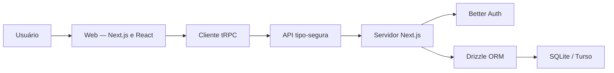

# appadosal

Plataforma full-stack TypeScript organizada como monorepo, criada para explorar contratos tipo-seguros, autenticação, persistência e experiência instalável na web.

O projeto funciona como um laboratório de engenharia de produto: front-end, servidor e banco de dados evoluem no mesmo workspace, mas mantêm responsabilidades explícitas.

## Objetivos técnicos

- compartilhar tipos entre cliente e servidor;
- reduzir divergências entre chamadas de API e implementação;
- estruturar autenticação por e-mail e senha;
- modelar persistência com migrações reproduzíveis;
- oferecer experiência PWA;
- manter validação, testes e formatação automatizados;
- permitir evolução futura para outros clientes dentro do monorepo.

## Arquitetura



## Organização do workspace

```text
appadosal/
├── apps/
│   ├── web/          # aplicação Next.js e experiência PWA
│   └── server/       # API, autenticação e persistência
├── packages/         # espaço para contratos e módulos compartilhados
├── docs/             # decisões, testes e fluxo do sistema
├── package.json
└── pnpm-workspace.yaml
```

## Stack

**Web**  
`Next.js` · `React` · `TypeScript` · `Tailwind CSS` · `Radix UI` · `TanStack Query` · `TanStack Form` · `Zod`

**Integração**  
`tRPC` · contratos tipo-seguros de ponta a ponta

**Servidor e dados**  
`Next.js` · `Better Auth` · `Drizzle ORM` · `SQLite` · `Turso`

**Qualidade**  
`Jest` · `Testing Library` · `Biome` · `Markdownlint` · `Husky` · `lint-staged`

## Execução local

### Requisitos

- Node.js compatível com as aplicações;
- `pnpm 10.11.0`;
- Turso CLI para execução local do banco.

### Instalação

```bash
git clone https://github.com/BrunoCesarAngst/appadosal.git
cd appadosal
pnpm install
```

### Banco de dados

```bash
cd apps/server
pnpm db:local
```

Em outro terminal, na raiz:

```bash
pnpm db:push
pnpm dev
```

Aplicação web: `http://localhost:3001`  
Servidor: `http://localhost:3000`

## Comandos principais

```bash
pnpm dev             # inicia os workspaces
pnpm build           # compila as aplicações
pnpm check-types     # verifica tipos
pnpm test            # executa testes
pnpm test:coverage   # mede cobertura
pnpm check           # valida e formata com Biome
pnpm db:generate     # gera artefatos de migração
pnpm db:migrate      # aplica migrações
pnpm db:studio       # abre o Drizzle Studio
```

## Decisões de engenharia demonstradas

- monorepo com execução coordenada por workspaces;
- fronteira tipo-segura entre cliente e servidor;
- persistência modelada por schema e migrações;
- autenticação tratada como capacidade transversal;
- comandos distintos para desenvolvimento, build, tipos e banco;
- documentação técnica mantida junto ao código;
- hooks de Git para reduzir regressões antes do commit.

## Documentação

- [Configuração de testes](./docs/CONFIGURACAO_TESTES.md)
- [Estratégia de testes](./docs/ESTRATEGIA_TESTES.md)
- [Fluxo do sistema](./docs/FLUXO.md)
- [Melhorias planejadas](./docs/MELHORIAS.md)

## Estado do projeto

Projeto público de portfólio e experimentação arquitetural. O foco está na estrutura técnica e na evolução do sistema, não na representação de um serviço oficial.

---

[Perfil de Bruno César Angst](https://github.com/BrunoCesarAngst) · [Site](https://brunoangst.com.br/)
